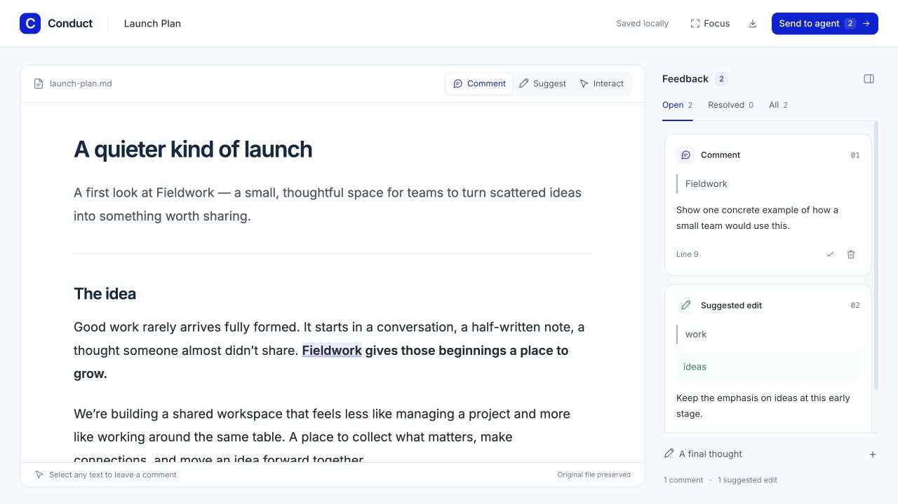

<div align="center">

# Conduct

### A quiet space to read. A precise way to give feedback.

Review your agent's Markdown, HTML, and React in the browser.<br>
Comment on the exact words. Suggest a change. Send the review back.

[](https://bun.com)
[](https://github.com/alexnederlof/conduct/actions/workflows/ci.yml)
[](LICENSE)
[](#your-files-your-review)

[Get started](#get-started) · [Connect your agent](#connect-your-agent) · [Review Claude plans](#review-claude-code-plans) · [Documentation](#documentation)

</div>



Your agent has written a plan, a proposal, or a prototype. You have thoughts about _this sentence_, _that assumption_, and _the wording right here_. Conduct gives those thoughts a place beside the work—and gives the agent enough context to act on them.

- **Read comfortably.** Locally bundled Inter, generous spacing, a focused reading mode, and a quiet interface.
- **Comment where it matters.** Selecting text opens a composer immediately. Feedback stays connected to the selected passage.
- **Suggest better wording.** Propose a replacement or deletion, with the original and suggested text visible together.
- **Hand it back deliberately.** **Send to agent** publishes a review with exact quotes, context, source snapshots, and suggested replacements.
- **Present more than prose.** Markdown, HTML, and React work out of the box, with Tailwind and a curated shadcn component set.

No account, API key, database server, or hosted service. Built with Bun.

## Get started

Use **Node.js 20+ and npm**, **Bun 1.3.14+**, or a [standalone executable](https://github.com/alexnederlof/conduct/releases). You also need a current browser with the CSS Custom Highlight API.

### Run directly from GitHub

With Node.js and npm—Bun is included automatically:

```sh
npx --yes --package github:alexnederlof/conduct conduct ./proposal.md
```

Or with Bun:

```sh
bunx --bun --package github:alexnederlof/conduct conduct ./proposal.md
```

Use the same command with an `.html`, `.tsx`, or `.jsx` file. The first run downloads the package and its dependencies. Conduct opens your default browser, chooses an available port on `127.0.0.1`, and prints the review URL and feedback path. Keep the terminal running while you review; press `Ctrl+C` to stop it.

These commands use `main`; no release is required. Pin a version with `github:alexnederlof/conduct#v0.1.0` once that tag is published, or use a full commit SHA. For standalone downloads and the distinction between GitHub releases and npm’s `latest` tag, see [installation and releases](docs/distribution.md).

### Try the included examples

```sh
git clone https://github.com/alexnederlof/conduct.git
cd conduct
bun install
bun run start examples/launch-plan.md
```

| Try                                      | Command                                   |
| ---------------------------------------- | ----------------------------------------- |
| A Markdown launch plan                   | `bun run start examples/launch-plan.md`   |
| A styled HTML brief                      | `bun run start examples/brief.html`       |
| A React landing page                     | `bun run start examples/landing-page.tsx` |
| Tabs, cards, and other shadcn components | `bun run start examples/reading-room.tsx` |
| An interactive chart loaded from a CDN   | `bun run start examples/recharts.html`    |

> **Commands in this guide:** `conduct` means the package's CLI. Without a global install, replace it with `npx --yes --package github:alexnederlof/conduct conduct` or `bunx --bun --package github:alexnederlof/conduct conduct`. From a checkout, use `bun /absolute/path/to/conduct/src/cli.ts`.

## Your first review

1. **Select a passage.** The comment composer opens beside your selection.
2. **Leave feedback.** Add a comment, or choose **Suggest edit** and enter replacement text. An empty replacement suggests deleting the selection.
3. **Keep reading.** Your saved feedback appears in the sidebar. Click a card to revisit its passage; resolve or reopen feedback as you go. **Focus** hides the sidebar for uninterrupted reading.
4. **Send to agent.** Add an optional final thought, then submit the review when you're ready for the agent to continue.

Use `⌘ Enter` / `Ctrl Enter` to save a comment or suggestion, and `Escape` to close its composer. Switch to **Interact** to use buttons, tabs, or charts inside an HTML or React preview.

Saved feedback survives a page reload. Suggestions leave the original file intact; your agent applies the changes after reviewing them. A submission records an immutable round, so you can keep reviewing without losing the previous handoff.

## Connect your agent

Install the bundled skill to teach your agent how to present a document, wait for your review, and interpret inline feedback:

```sh
# Claude Code + Codex / agents that discover .agents/skills
conduct install skill

# Or choose an agent
conduct install skill claude
conduct install skill codex
conduct install skill agents

# Scope it to the current project
conduct install skill all --project
```

**Global is the default.** `--global` / `-g` makes that explicit; `--project` / `-p` installs in the current directory. Run project installation from the project root.

| Agent                       | Global skill location       | Project skill location    |
| --------------------------- | --------------------------- | ------------------------- |
| Claude Code                 | `~/.claude/skills/conduct/` | `.claude/skills/conduct/` |
| Codex and compatible agents | `~/.agents/skills/conduct/` | `.agents/skills/conduct/` |

`codex` and `agents` share the same location. The installer copies a persistent runtime, including the executable, and writes its absolute command into the skill. Clearing the npm/BunX cache or moving the checkout won't break it. Rerun the installer after upgrading Conduct. Restart your agent if the skill does not appear.

Then ask your agent:

> Write the proposal as Markdown and present it with Conduct. Wait for me to send my review, then use the inline feedback to revise it.

### Any agent can use the CLI

The handoff is a local file. An agent needs only a shell and access to that file:

```sh
# Terminal A: keep the presenter running
conduct present ./proposal.md

# Terminal B: return submitted feedback when the reviewer clicks Send to agent
conduct wait ./proposal.md --after 0 --timeout 600

# Inspect saved feedback in a readable format
conduct feedback ./proposal.md --format markdown
```

Feedback is saved to `proposal.md.feedback.json` by default. Use `--out ./review.json` on **all three commands** to choose another location. `wait` returns submitted rounds as JSON; save the highest returned round number and use it as the next `--after` cursor. Drafts do not wake the agent. A timeout exits nonzero and does not mean approval.

**Send to agent publishes feedback; it does not call an LLM or send a chat message.** Your existing agent reads the result and continues the conversation.

## Review Claude Code plans

Use Conduct at Claude Code's native plan approval step:

```sh
conduct install hook             # All Claude Code projects
conduct install hook --project   # Only the current project
```

Restart Claude Code, enter plan mode, and ask it to plan as usual. When Claude calls `ExitPlanMode`, Conduct opens the plan in your browser and waits for your decision.

| In Conduct                             | What happens in Claude Code                                                                |
| -------------------------------------- | ------------------------------------------------------------------------------------------ |
| **Approve plan**                       | Claude continues in the same conversation with your comments and suggestions.              |
| **Request changes**                    | Claude receives the anchored feedback, stays in plan mode, and can present a revised plan. |
| Close the tab or leave the review idle | Nothing is approved. An unanswered review expires after 59 minutes.                        |

Each review is tied to an exact plan snapshot. Changed plans, cancellation, and expired reviews are denied. Suggestions are instructions for Claude to apply, not automatic edits to the plan file.

The hook is independent of the skill. It preserves other hooks, settings, and implementation permissions. Global settings use `~/.claude/settings.json`; project settings use `.claude/settings.local.json`. `CLAUDE_CONFIG_DIR` is respected.

The full change-request → revision → approval flow has been verified in **interactive Claude Code 2.1.260**. Other permission rules or managed settings may still require Claude's native prompt. See [plan hook details and troubleshooting](docs/agents.md#claude-code-plan-approval).

### Update or uninstall

Rerun an install command with the newer Conduct version to update it. To remove an integration, use the same scope you installed:

```sh
conduct uninstall skill                 # All supported agents, globally
conduct uninstall hook                  # Global Claude Code plan hook
conduct uninstall skill all --project
conduct uninstall hook --project
```

Uninstall preserves review history and cached runtimes. Existing or edited skill instructions are protected; use `--force` on a skill command only when you intend to replace or remove them. See [installation details](docs/agents.md#install-the-agent-skill) for paths and cleanup.

## Bring your own format

| Format            | Best for                                          | Included                                                    |
| ----------------- | ------------------------------------------------- | ----------------------------------------------------------- |
| Markdown          | Plans, proposals, research, prose                 | Tables, fenced code, raw HTML, a comfortable reading layout |
| HTML              | Existing documents, custom layouts, CDN libraries | Tailwind, local assets, inline and external JavaScript      |
| React / TSX / JSX | Reusable layouts and interactive ideas            | Bun bundling, React, Tailwind, curated shadcn components    |

### A React document is just a component

Save this as `proposal.tsx`, then run `conduct proposal.tsx`:

```tsx
import { Badge, Card, CardContent, CardHeader, CardTitle } from 'conduct/ui';

export default function Proposal() {
  return (
    <main className="mx-auto max-w-2xl p-8">
      <Card className="shadow-none">
        <CardHeader>
          <CardTitle>A small, considered step</CardTitle>
        </CardHeader>
        <CardContent className="space-y-5">
          <Badge variant="secondary">Ready for your thoughts</Badge>
          <p className="text-lg leading-relaxed">
            Let's start with twenty teams and learn from the work they do.
          </p>
        </CardContent>
      </Card>
    </main>
  );
}
```

React, React DOM, and `conduct/ui` are provided by Conduct, even outside a JavaScript project. The component set includes **Button, Badge, Card, Input, Textarea, Tabs, and Accordion**. Use complete Tailwind class names; dynamic strings such as `bg-${color}-500` cannot be scanned.

For additional npm libraries, install dependencies in the document's project with Bun and import them normally. HTML can load arbitrary external scripts, ES modules, and import maps—no CDN allowlist or extra flag. The [Recharts example](examples/recharts.html) demonstrates this. Browser CORS rules still apply.

For prose in HTML or React, use `<article class="conduct-prose">…</article>` to get the Markdown reading layout. See the [authoring guide](docs/authoring.md) for components, assets, styling, and chart libraries.

## Your files, your review

Conduct serves one local document per session. It has no telemetry or cloud backend. Fonts, Tailwind, and built-in components are served locally; documents can opt into external resources.

Previews run in a sandboxed iframe with a separate capability from the feedback API. External JavaScript can read the presented document and contact external sites, so choose documents and libraries you trust. The review controls and feedback API remain isolated from the preview.

A few useful boundaries:

- Edits are **suggestions** for the agent, not a rich-text editor or automatic source patcher.
- Feedback anchors refer to rendered text. Markdown and HTML also include containing source lines; React uses quotes, surrounding context, headings, and selectors.
- Changing the source while reviewing blocks submission. Restart the presenter for the revised source; previous rounds are retained. Restart after changing imported components or assets too.
- Conduct presents individual files, not an existing Next.js/Vite application. MDX, server components, and annotations on images or canvas are not supported.
- Review JSON includes the source and feedback. Add `*.feedback.json` and `*.feedback.json.lock` to your project's `.gitignore` unless you intend to share them.

## Troubleshooting

| Symptom                                   | What to do                                                                                                                                                                     |
| ----------------------------------------- | ------------------------------------------------------------------------------------------------------------------------------------------------------------------------------ |
| The browser didn't open                   | Open the full URL printed by the CLI, including its `#` fragment. Use `--no-open` when opening it yourself.                                                                    |
| A button or chart doesn't respond         | Choose **Interact** in the document toolbar. Return to **Comment** or **Suggest** to select text.                                                                              |
| The agent is still waiting                | Click **Send to agent**. Check that `present` and `wait` use the same feedback path and that `--after` is the last round already read.                                         |
| The source changed                        | Stop and restart the presenter. Your earlier rounds remain saved.                                                                                                              |
| Another presenter owns the feedback file  | Stop that presenter, or choose a different `--out` path.                                                                                                                       |
| A React import cannot be resolved         | Install that dependency in the document's project. Conduct supplies React, React DOM, and `conduct/ui`.                                                                        |
| Claude still shows its normal plan prompt | Restart Claude, use interactive plan mode, and check whether hooks are disabled or other permission rules apply. See [hook details](docs/agents.md#claude-code-plan-approval). |

## Documentation

- [Installation and releases](docs/distribution.md) — `npx`, BunX, executables, version pins, CI approval, and publishing.
- [Authoring documents](docs/authoring.md) — formats, Tailwind, shadcn, local assets, and external libraries.
- [Working with agents](docs/agents.md) — skills, installation, round cursors, and Claude Code's plan hook.
- [Feedback and API reference](docs/reference.md) — JSON schema, anchor semantics, persistence, and local endpoints.
- [Bundled agent skill](skills/conduct/SKILL.md) — the instructions installed into your agent.
- [Contributor and agent guide](AGENTS.md) — architecture, commands, and behaviors to preserve.

## Contributing

CI runs the full test suite, TypeScript checks, and packaged `npx` smoke tests on Linux and macOS. Pull requests from outside contributors wait for maintainer approval before workflows run. See [contributor approval and releases](docs/distribution.md#ci-and-contributor-approval).

Bug reports, thoughtful improvements, and small, reproducible examples are welcome. [Open an issue](https://github.com/alexnederlof/conduct/issues) or send a pull request.

```sh
bun install
bun run dev        # Starts the Markdown demo without launching a browser
bun run check      # TypeScript + Bun tests
```

Keep the reading experience focused and the handoff precise. See [AGENTS.md](AGENTS.md) before making changes; `CLAUDE.md` is a symlink to that same guide. Temporary artifacts belong in `.temp/`. Restart the server after changing code.

To inspect a distributable, run `bun pm pack --destination .temp`. Conduct ships TypeScript source and bundles the browser UI at startup; no separate build step is required.

## License

[MIT](LICENSE) © 2026 Conduct contributors. Third-party component and font attributions are preserved in [THIRD_PARTY_NOTICES.md](THIRD_PARTY_NOTICES.md).
